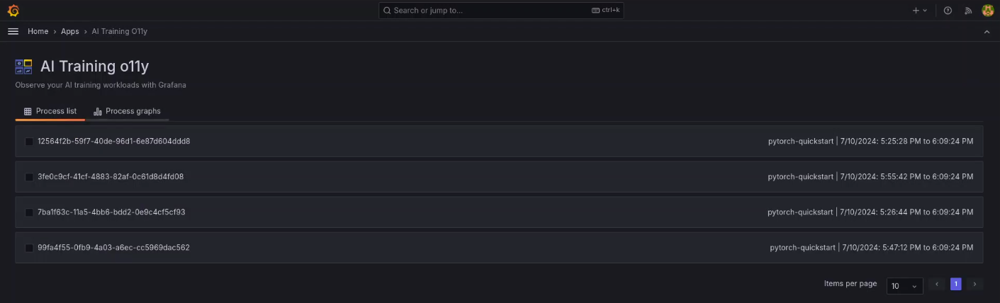
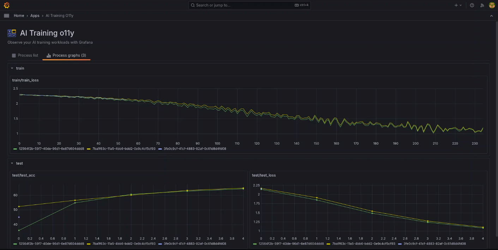

# AI Training Observability

AI Training Observability is a Grafana plugin to help you observe your AI training workloads.

We're assuming (for now) that you're running your training in Python.

You can capture training metrics with little more than `import o11y` and e.g. `o11y.log({'train/train_loss': loss})` in your training loop.

Then in AI Training App in Grafana, review and compare your processes and their status & captured metrics.

We expect future versions to correlate your training progress with Grafana's extensive hardware monitoring options, as well as easy integration with alerting, etc.; these are possible for now only with more manual setup.

## What stage is this project?

**Experimental**. It works, but many of the bells & whistles that will probably be useful aren't here yet.

This first iteration was built by the Grafana AI/ML team, because:

1) we see a need for experiment tracking supported by Grafana's big tent of monitoring options
2) we'd love to know who in the Grafana community and among our customers wants to see this move forward

It's not a supported product (yet), though it can become one if there's enough interest.

The easiest way to try it out is to tell us you'd like to use this in Grafana Cloud; we can install the plugin to your instance.

You can reach us via your support contact in Grafana Cloud, or in the [https://grafana.slack.com/archives/C02GWJX681J](#machine-learning channel in Grafana Community Slack).

Or feel free to try it out locally! Raise issues in the repo as needed, or raise PRs.

## Layout of this repo

- Project root contains anything necessary to spin up a dev environment to test end-to-end
- `.config/` has config files for the dev environment
- `o11y/` is the python exporter
- `ai-training-api/` contains the metadata (and maybe proxy) service and any necessary files for mysql (specifying database configuration, especially)
- `grafana-aitraining-app/` contains the grafana plugin

## Development

Requires:

- Python (3.8 or later)
- Hatch (best installed via "pipx install hatch" if you have pipx)
- Node (20 or later)
- Go (1.22 or later)
- Docker
- Yarn (4.1.1)
- Make
- Mage

Builds dev environment with "make docker"

Once it's up, you can background it or open another terminal and use "make jupyter" to open a jupyter server. It will have a link to jupyter in your terminal.

Grafana will be hosted at localhost:3000 (including this plugin)

## Licensing

See [LICENSING.md](LICENSING.md)
